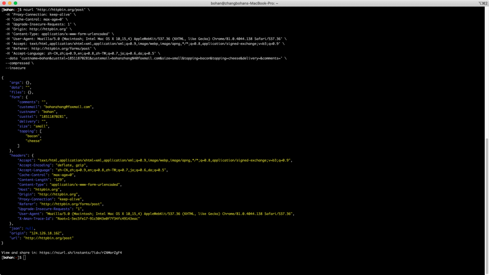

# NcURL - Next generation of cURL

Fully compatible with cURL. And with JSON support, syntax highlight, easy to share with others.


[![Maintenance Status][maintenance-image]](#maintenance-status)



## Install

### Mac

```
$ brew tap ncurl/ncurl
$ brew install ncurl
```

### by PYPI

```shell
$ pip install ncurl
```

## Usage

Fully compatible with cURL, support all curl options, just change `curl` to `ncurl`

```
$ ncurl -i -X POST http://httpbin.org/post -H "accept: application/json"
HTTP/1.1 200 OK
Date: Thu, 21 May 2020 03:42:47 GMT
Content-Type: application/json
Content-Length: 332
Connection: keep-alive
Server: gunicorn/19.9.0
Access-Control-Allow-Origin: *
Access-Control-Allow-Credentials: true
{
    "args": {},
    "data": "",
    "files": {},
    "form": {},
    "headers": {
        "Accept": "application/json",
        "Host": "httpbin.org",
        "User-Agent": "curl/7.64.1",
        "X-Amzn-Trace-Id": "Root=1-5ec5f8b7-7fd4fd30651bab20b5be86b0"
    },
    "json": null,
    "origin": "124.126.18.162",
    "url": "http://httpbin.org/post"
}

View and share in: https://ncurl.sh/instants/?id=/rZAGCMGcKP
```

## LICENSE

MIT

## Maintenance Status

**Active:** Formidable is actively working on this project, and we expect to continue for work for the foreseeable future. Bug reports, feature requests and pull requests are welcome.

[maintenance-image]: https://img.shields.io/badge/maintenance-active-green.svg
